## STEP 1 — INSTALLING THE NGINX WEB SERVER

If I want to display web pages to my site for visitors, I will employ Nginx, a high-performance web server. I will need to install the package. But before I do so, I will first update my servers package since its the first time running it with the command below

`sudo apt update`

Then I install the Nginx server package with the command below

`sudo apt install nginx`

To verify that nginx was successfully installed and is running as a service in Ubuntu, run:

`sudo systemctl status nginx`

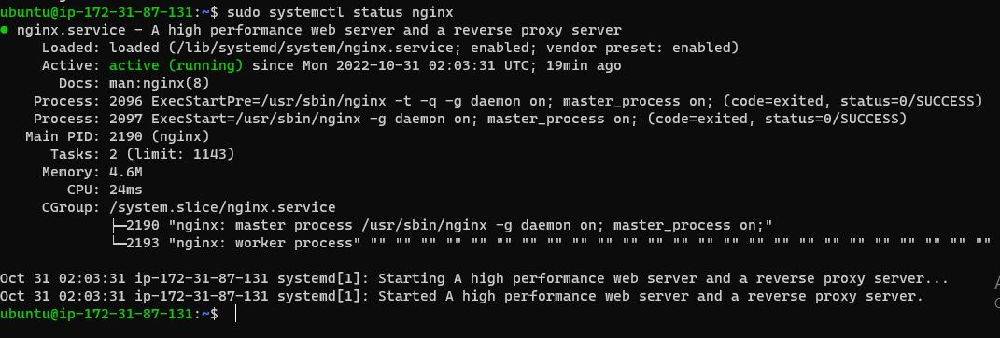

I will now access the nginx default page locally using:

curl http://127.0.0.1:80

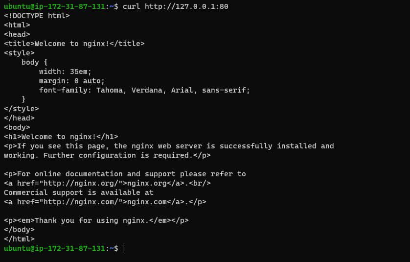

Below is an image of the localhost on the browser

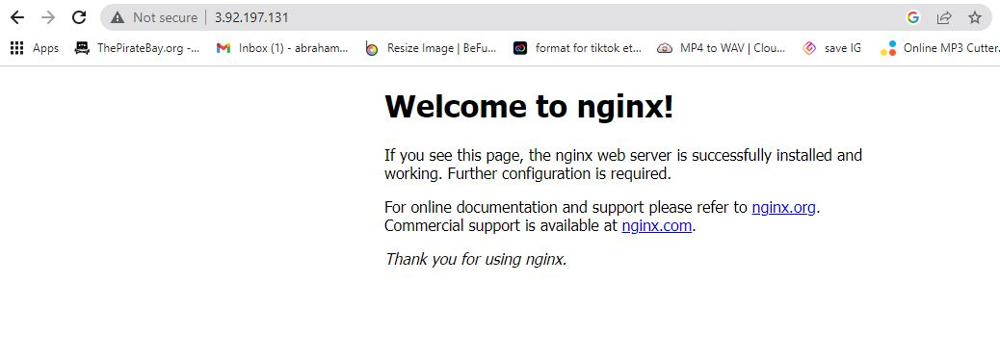

## STEP 2 — INSTALLING MYSQL

`$ sudo apt install mysql-server`

After running Mysql, we would run it by typing this commqand

`sudo mysql` 

then I type the command below to show database 

`show databases;`

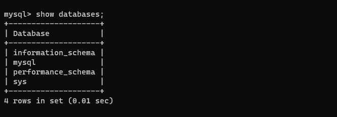

## STEP 3 – INSTALLING PHP

sudo apt install php-fpm php-mysql

## STEP 4 — CONFIGURING NGINX TO USE PHP PROCESSOR

1. Create the root web directory for your_domain as follows:

`sudo mkdir /var/www/projectLEMP`

2. assign ownership of the directory with the $USER environment variable

`sudo chown -R $USER:$USER /var/www/projectLEMP`

3. Then, open a new configuration file in Nginx’s sites-available directory using your preferred command-line editor. Here, we’ll use nano:

`sudo nano /etc/nginx/sites-available/projectLEMP`

The bare-bones configuration ashould be entered into the console with this code: 

server {
    listen 80;
    server_name projectLEMP www.projectLEMP;
    root /var/www/projectLEMP;

    index index.html index.htm index.php;

    location / {
        try_files $uri $uri/ =404;
    }

    location ~ \.php$ {
        include snippets/fastcgi-php.conf;
        fastcgi_pass unix:/var/run/php/php8.1-fpm.sock;
     }

    location ~ /\.ht {
        deny all;
    }

}

Now to test the Configuration  

`sudo nginx -t`

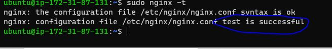

Now to unlink the default Nginx host

`sudo unlink /etc/nginx/sites-enabled/default`

`sudo systemctl reload nginx`

then we put Ip adress in a browser and get the result below because we do not have any files there

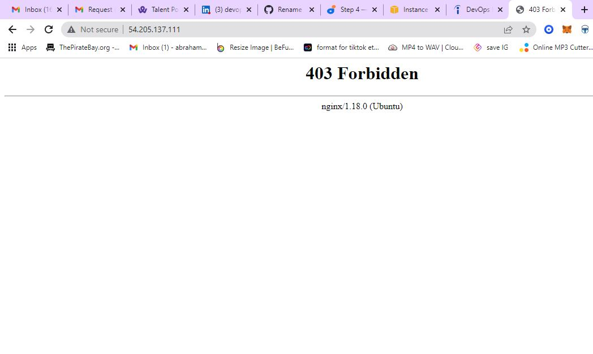

Now we enter this code anbd relaod 

`sudo echo 'Hello LEMP from hostname' $(curl -s http://169.254.169.254/latest/meta-data/public-hostname) 'with public IP' $(curl -s http://169.254.169.254/latest/meta-data/public-ipv4) > /var/www/projectLEMP/index.html`

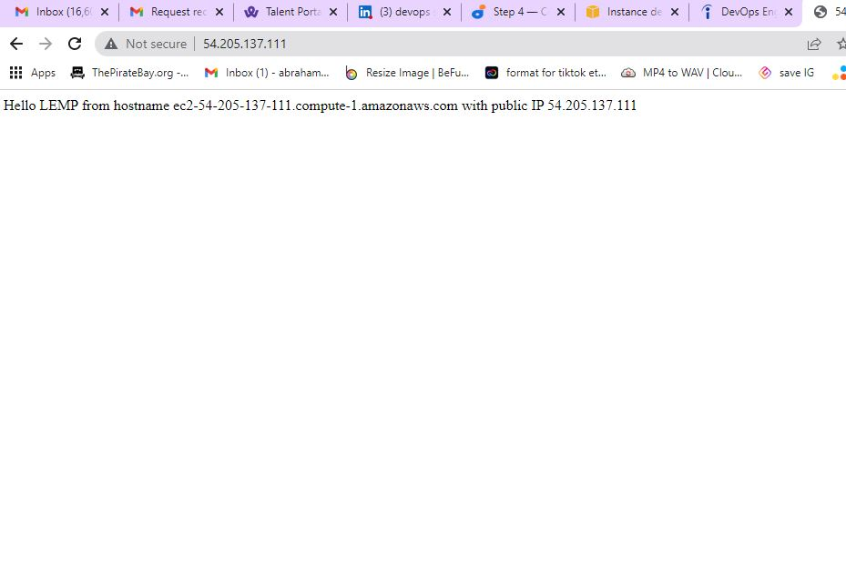

## STEP 5 – TESTING PHP WITH NGINX

test it to validate that Nginx can correctly hand .php files

`sudo nano /var/www/projectLEMP/info.php`

then inout in the console: 

`<?php``phpinfo();`

I can now access this page in MY web browser by visiting the domain name or public IP address I set up in your Nginx configuration file, followed by /info.php

`http://54.205.137.111/info.php`

I will now remove the file I created as it contains sensitive info with the command below 

`sudo rm /var/www/projectLEMP/info.php`

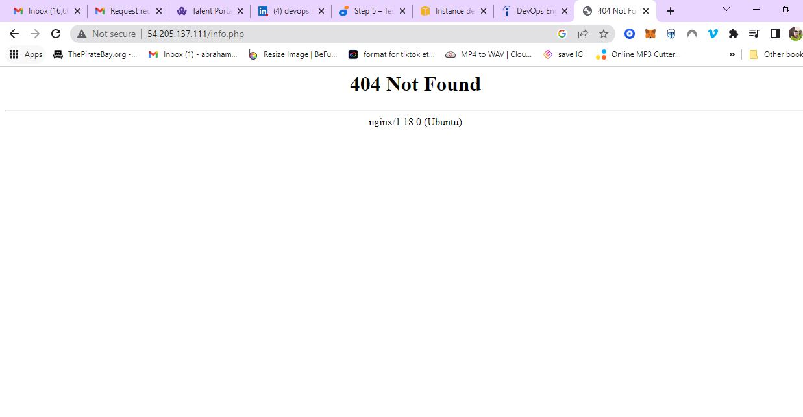

## STEP 6 – RETRIEVING DATA FROM MYSQL DATABASE WITH PHP (CONTINUED)

before we create a database we would run this command below to show databases

`SHOW DATABASES;`

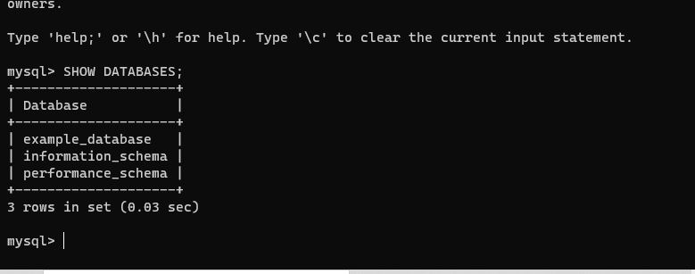

Next, we’ll create a test table named todo_list. From the MySQL console, run the following statement:

CREATE TABLE example_database.todo_list (
     item_id INT AUTO_INCREMENT,
     content VARCHAR(255),
     PRIMARY KEY(item_id)
 );

mysql> INSERT INTO example_database.todo_list (content) VALUES 
('My first important item'),
('my second important item'),
('my third importqant item'),
('and one last thing');

after adding these 4 values run this code to view table

`SELECT * FROM example_database.todo_list;`

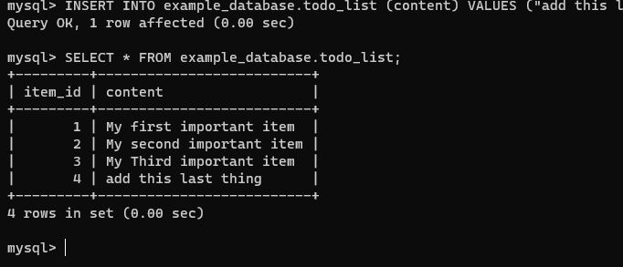

create a PHP script that will connect to MySQL and query for your content by entering code:

`nano /var/www/projectLEMP/todo_list.php`

The input this content in the todo list php console:

we view our public ip address and view the contents 

`http://44.204.89.252/todo_list.php`

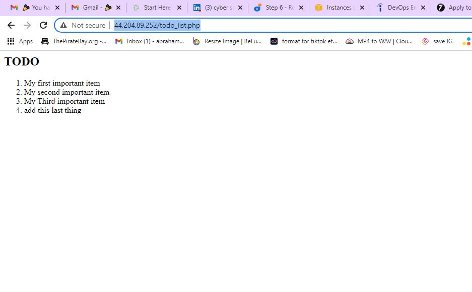

That means your PHP environment is ready to connect and interact with your MySQL server.

